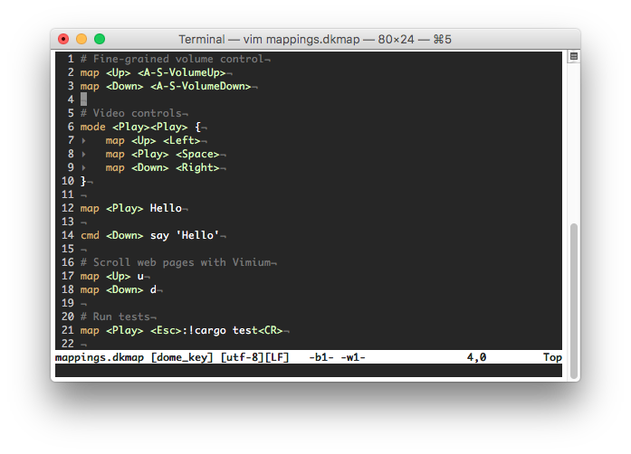

vim-dome-key
============

Provides syntax highlighting and comment support for the [DomeKey][1] mapping
language.

## License
Copyright © 2018 Teddy Wing. Licensed under the GNU GPLv3+ (see the included
COPYING file).

[1]: https://domekey.teddywing.com/
